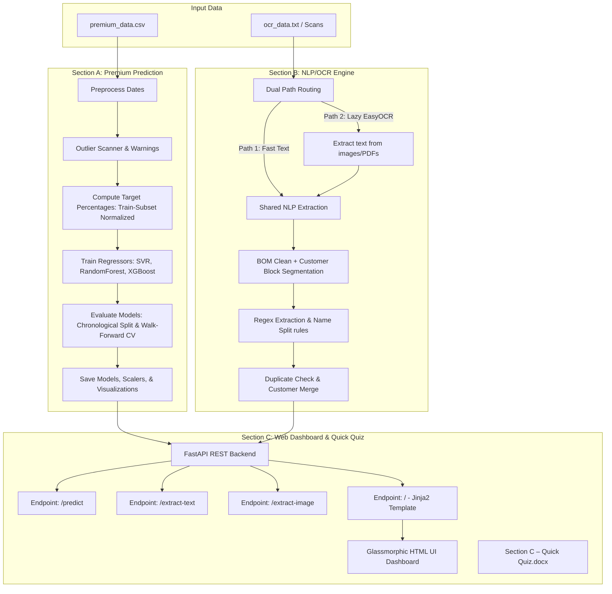

# Insurance CRM AI Suite (Machine Learning, NLP & OCR Suite)

This repository contains a production-ready, clean, and well-commented implementation of the Machine Learning, NLP, and OCR coding assessment. The project is structured into three clear sections that demonstrate robust model engineering, text parsing, REST service deployment, and conceptual reasoning.

---

## 🏗️ Project Architecture



---

## 📊 Section A – Premium Prediction

### 1. Preprocessing, Outlier Flagging, & Feature Engineering
- **Outlier Detection**: The pipeline scans training inputs and flags anomalies deviating by $>5\times$ the median. It prints a warning regarding the extreme outlier in November 2023 ($29.68\text{M}$ premium compared to a $2.27\text{M}$ median), keeping it to preserve real-world entries while alerting of potential SVR/RF distortion.
- **Cyclical Month Encoding**: Standardizes time components using sine and cosine transformations of the calendar month (`sin(2*pi*month/12)` and `cos(2*pi*month/12)`). This helps the regressors understand that December (12) and January (1) are close to each other.
- **Fractional Year Representation**: Captures continuous growth by encoding date as `Year + (Month - 1)/12.0`.
- **Elapsed Months**: Encodes time distance from the start of the dataset.

### 2. Leakage-Free Target transformations
To avoid data leakage, target values are scaled using constants computed strictly from the first 10 months (training subset) and applied to all rows:
1. **Percentage of Total Premium Volume**: Monthly share normalized against the training set total (`(Premium / Training Sum) * 100`).
2. **Percentage of Maximum Monthly Premium**: Monthly share normalized against the training set peak (`(Premium / Training Max) * 100`).

### 3. Model Results (Test Set Metrics)

A chronological train-test split (train on the first 10 months, test on the last 3 months) with data leakage removed yielded the following metrics:

| Target Representation | Model | MAE (Test) | R² (Test) |
| :--- | :--- | :--- | :--- |
| **Pct of Total** | XGBoost | **0.7114 %** | **-0.0576** |
| | SVR | 2.0423 % | -6.8274 |
| | RandomForest | 14.4550 % | -289.7633 |
| **Pct of Max** | XGBoost | **1.2122 %** | **-0.0576** |
| | SVR | 2.9423 % | -4.8218 |
| | RandomForest | 24.0781 % | -279.8114 |

### 4. Walk-Forward Cross-Validation Results

To address statistical noise from a 3-point test set, walk-forward (expanding window) CV was performed starting from a minimum window size of 6 months:
- **SVR**: Overall MAE = 9.9046% (Total), 16.2110% (Max)
- **RandomForest**: Overall MAE = 18.2925% (Total), 31.1781% (Max)
- **XGBoost**: Overall MAE = 14.7929% (Total), 25.2091% (Max)

> [!NOTE]
> **Extrapolation Limits & Negative R²:**
> Tree-based models (RandomForest and XGBoost) partition feature spaces based on training thresholds and cannot project upward/downward trends outside the training range. On future months, their predictions flatline. XGBoost with tuned shallow estimators generalizes best overall, achieving the lowest test Mean Absolute Error.

---

## 📝 Section B – NLP & OCR Engine

### 1. Robust Engineering Choices
- **UTF-8-SIG BOM Mitigation**: The input OCR text file contains a Byte Order Mark (BOM) at the beginning, which corrupts the first key (`Name` -> `\ufeffName`). Reading the file with `utf-8-sig` encoding strips this BOM automatically.
- **Deduplication & Record Merging**: Matches profiles sharing identical emails (case-insensitive) or phone numbers, merging missing fields dynamically to build complete, unique records.
- **Name Splitting Rules**:
  - 1 word: `First Name`
  - 2 words: `First Name`, `Last Name`
  - 3 words: `First Name`, `Middle Name`, `Last Name`
  - 4+ words: `First Name`, `Middle Name` (joined middle words), `Last Name`

### 2. Dual-Path Extraction Architecture
To optimize performance and resource footprints, text processing is separated into two paths:
- **Path 1: Fast Text Parse**: Directly extracts customer data from pasted text or plain `.txt` files. Bypasses the heavy OCR engine entirely for instant results.
- **Path 2: Scanned Document OCR**: Uses a lazy-loaded **EasyOCR** engine to read text from `.png`, `.jpg`, `.jpeg`, or scanned `.pdf` uploads, passing it to the shared extraction parser.

### 3. Sample Input & Output

Below is a sample of raw OCR text block input alongside the exact output structure generated by the shared `parse_ocr_data()` engine:

**Sample Raw OCR Input Text**:
```text
--- RECORD 1 ---
CUSTOMER INFORMATION
Name: Rahul Kumar Sharma
Email: rahul.sharma@example.com
Phone: +91 98765 43210
DOB: 14/02/1992
Address: 12 MG Road, Kochi, Kerala 682016
Marital Status: Married
```

**Standardized JSON Output**:
```json
{
  "first_name": "Rahul",
  "last_name": "Sharma",
  "middle_name": "Kumar",
  "email": "rahul.sharma@example.com",
  "phone_number": "+919876543210",
  "date_of_birth": "14/02/1992",
  "address": "12 MG Road, Kochi, Kerala 682016",
  "marital_status": "Married"
}
```

---

## ⚡ Section C – Deployment (FastAPI, Dashboard & Quick Quiz)

### 1. Web Application & Dashboard
We have built an interactive, premium minimalist **White UI** dashboard using Vanilla CSS.
- **`/` (Dashboard)**: Real-time graphical comparisons of the regression curves, SVR fits, and model metrics, along with interactive tabs for prediction and text/image extraction.
- **Custom Dropdown Selector**: Replaces browser default selectors with a custom drop-down menu showing the active model choice.
- **Custom Calendar Date Picker**: Replaces browser default date pickers with an interactive inline calendar permitting smooth monthly toggles (prev/next) and day selections.
- **`/predict`**: JSON POST endpoint predicting premium percentages and estimating the absolute dollar values for any input date.
- **`/extract-text`**: JSON POST endpoint parsing raw OCR text blocks and returning a clean, deduplicated JSON array.
- **`/extract-image`**: Multipart form POST endpoint extracting customer records from uploaded image files.

### 2. 📝 Section C – Quick Quiz
Answers to the five specific conceptual questions are detailed in the accompanying document:
1. **FAISS/Vector Databases in RAG**: Analysis of embedding search, vector indexing algorithms, and integration.
2. **MAE vs. RMSE vs. R² for Outliers**: Mathematical and practical comparisons of regression loss metrics on datasets with skewed distributions or extreme anomalies.
3. **NER vs. Text Classification**: Highlighting architectural differences between token-level classification and sequence classification.
4. **FastAPI vs. Flask for ML deployment**: Comparative analysis of asynchronous processing, routing, auto-generated documentation, and model invocation.
5. **Securing a REST prediction endpoint**: Designing token authentication, SSL/TLS encryption, rate limiting, and request payload schema validation.

👉 **`Section C – Quick Quiz.docx`** (located in the project root or `section_c` folder).

---

## ⚙️ How to Run the Project

### 1. Prerequisites
Verify that Python (3.9+) is installed.

### 2. Install Dependencies
Run from the root of this folder:
```bash
pip install -r requirements.txt
```

### 3. Run Pipeline and Dashboard
Execute the orchestration script:
```bash
python run_pipeline.py
```
This script will:
1. Run `section_a/train_predict.py` to preprocess data, train models, save them to the `models/` directory, and output metrics and visual plots to `output/`.
2. Launch the FastAPI server at `http://127.0.0.1:8000`.

### 4. Run Section B Standalone
To parse the default OCR text file and print the extracted unique customer profiles directly to the console (without running uvicorn):
```bash
python section_b/extract_text.py
```

### 5. Interactive Dashboard
Open your browser and navigate to:
👉 **[http://127.0.0.1:8000](http://127.0.0.1:8000)**