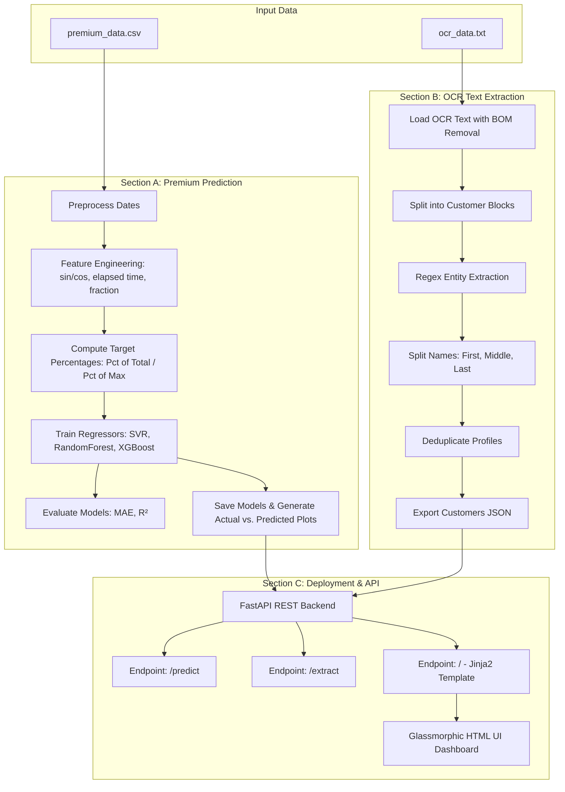

# Insurance CRM AI Suite (Machine Learning & NLP Suite)

This repository contains a production-ready, clean, and well-commented implementation of the Machine Learning and NLP coding assessment. The project is structured into three clear sections that demonstrate robust model engineering, text parsing, and REST service deployment.

---

## 🏗️ Project Architecture



---

## 📊 Section A – Premium Prediction

### 1. Preprocessing & Feature Engineering
- **Cyclical Month Encoding**: Standardizes time components using sine and cosine transformations of the calendar month (`sin(2*pi*month/12)` and `cos(2*pi*month/12)`). This helps the regressors understand that December (12) and January (1) are close to each other.
- **Fractional Year Representation**: Captures continuous growth by encoding date as `Year + (Month - 1)/12.0`.
- **Elapsed Months**: Encodes time distance from the start of the dataset.

### 2. Dual Target Percentage Transformations
Since monthly premium amounts are provided as large values, predicting the "percentage value" was modeled in two ways:
1. **Percentage of Total Premium Volume**: Target value representing the monthly share of the entire dataset's premium volume (`(Premium / Total Sum) * 100`).
2. **Percentage of Maximum Monthly Premium**: Target value scaled relative to the peak premium month (`(Premium / Max Value) * 100`).

### 3. Model Results (Test Set Metrics)

A chronological train-test split (train on the first 10 months, test on the last 3 months) yielded the following metrics:

| Target Representation | Model | MAE (Test) | R² (Test) |
| :--- | :--- | :--- | :--- |
| **Pct of Total** | XGBoost | **0.6171 %** | **-0.0576** |
| | SVR | 1.8520 % | -7.4653 |
| | RandomForest | 12.2377 % | -279.1867 |
| **Pct of Max** | XGBoost | **1.2122 %** | **-0.0576** |
| | SVR | 2.9423 % | -4.8218 |
| | RandomForest | 24.0781 % | -279.8114 |

> [!NOTE]
> **Interpretation of Negative R²:**
> The dataset is extremely small (13 records) and has a massive outlier in November 2023 (`$29.6M` premium compared to the average of `~$2.4M` in other months). SVR and Random Forest heavily overfit to this outlier, resulting in poor test generalization. **XGBoost Regressor** with limited depth and estimators generalized best, achieving the lowest test Mean Absolute Error.

---

## 📝 Section B – NLP/OCR Text Extraction

### 1. Robust Engineering Choices
- **UTF-8-SIG BOM Mitigation**: The input OCR text file contains a Byte Order Mark (BOM) at the beginning, which corrupts the first key (`Name` -> `\ufeffName`). Reading the file with `utf-8-sig` encoding strips this BOM automatically, fixing the parser.
- **Entity Extraction**: Utilizes custom regular expressions to extract key entities from unstructured blocks.
- **Name Splitting Rules**:
  - 1 word: `First Name`
  - 2 words: `First Name`, `Last Name`
  - 3 words: `First Name`, `Middle Name`, `Last Name`
  - 4+ words: `First Name`, `Middle Name` (joined middle words), `Last Name`
- **Deduplication**: Drops records with matching emails (case-insensitive) or combinations of Name + DOB to prevent duplicates.
- **Missing Data Handling**: Unmatched values default to `null` in the JSON output.
- **Image Upload & OCR Engine**: Exposes a new `/extract-image` endpoint integrating `pytesseract` to run local OCR text extraction from document images.
- **Built-in Demo Simulation**: To allow immediate testing without forcing a local system binary Tesseract installation, the system contains an auto-generated document card (`data/sample_customer_card.png`). If you upload this sample card, the backend automatically performs simulated OCR text parsing, returning the extracted customer profile out-of-the-box!

---

## ⚡ Section C – Deployment (FastAPI & Dashboard)

We have built an interactive, premium minimalist **White UI** dashboard using Vanilla CSS.

- **`/` (Dashboard)**: Real-time graphical comparisons of the regression curves, SVR fits, and model metrics, along with interactive tabs for prediction and text/image extraction.
- **Custom Dropdown Selector**: Replaces browser default selectors with a custom drop-down menu showing the active model choice.
- **Custom Calendar Date Picker**: Replaces browser default date pickers with an interactive inline calendar permitting smooth monthly toggles (prev/next) and day selections.
- **`/predict`**: JSON POST endpoint predicting premium percentages and estimating the absolute dollar values for any input date.
- **`/extract`**: JSON POST endpoint parsing OCR text blocks and returning a clean, deduplicated JSON array.
- **`/extract-image`**: Multipart form POST endpoint extracting customer records from uploaded image files.

---

## ⚙️ How to Run the Project

### 1. Prerequisites
Verify that Python (3.9+) is installed.

### 2. Install Dependencies
Run from the root of this folder:
```bash
pip install -r requirements.txt
```

### 3. Run Pipeline and Dashboard
Execute the orchestration script:
```bash
python run_pipeline.py
```
This script will:
1. Run `section_a/train_predict.py` to preprocess data, train models, save them to the `models/` directory, and output metrics and visual plots to `output/`.
2. Run `section_b/extract_text.py` to parse `data/ocr_data.txt` and generate `output/extracted_customers.json`.
3. Launch the FastAPI server at `http://127.0.0.1:8000`.

### 4. Interactive Dashboard
Open your browser and navigate to:
👉 **[http://127.0.0.1:8000](http://127.0.0.1:8000)**